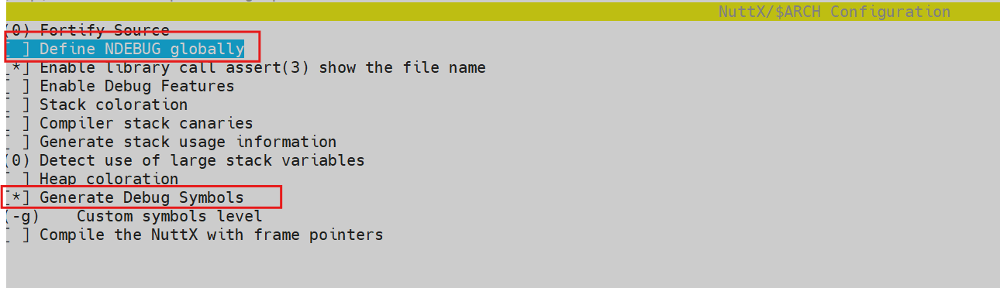
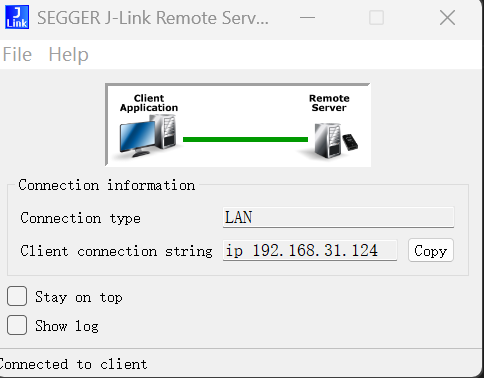
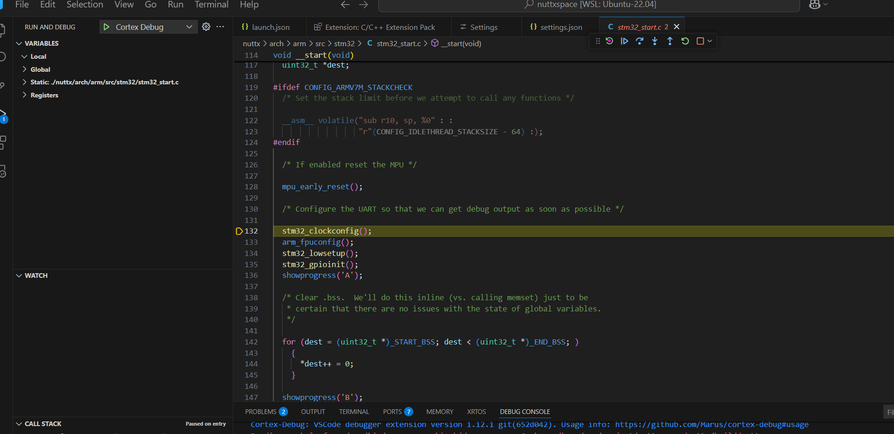

nuttx需要单步调试的话需要打开两个配置项,编译出来才会带符号表


我是在wsl2中配置的环境，使用jlink来进行调试。

1. 主机环境先打开jlink remote server
   

2. wsl中使用如下命令即可和jlink连接，并进行烧录操作。
```
   JLinkExe -device STM32F411CE -ip 192.168.31.124 -if SWD -speed 4000 -autoconnect 
```
3. vscode中的debug配置
   - 先安装cortex-debug插件.
   - 再安装gdb-multiarch
   - 配置debug启动

   ```
      launch.json

      {
      // Use IntelliSense to learn about possible attributes.
      // Hover to view descriptions of existing attributes.
      // For more information, visit: https://go.microsoft.com/fwlink/?linkid=830387
      "version": "0.2.0",
      "configurations": [
         {
               "name": "Cortex Debug",
               "cwd": "${workspaceFolder}",
               "executable": "${workspaceFolder}/nuttx/build/nuttx",
               "request": "launch",
               "type": "cortex-debug",
               "runToEntryPoint": "main",
               "servertype": "jlink",
               "ipAddress": "192.168.31.124",
               "interface": "swd",
               "device": "STM32F411CE"
         }
      ]
      }

   ```
   - 配置gdbserver和gdb路径 
   ```
   settings.json

   {
      "cortex-debug.gdbPath": "/usr/bin/arm-none-eabi-gdb",
      "cortex-debug.JLinkGDBServerPath": "/usr/bin/JLinkGDBServerCLExe"
   }
   ```

   - 保持主机的jlink remote server在开启状态。
   - 然后启动debug，就可以调试了
     