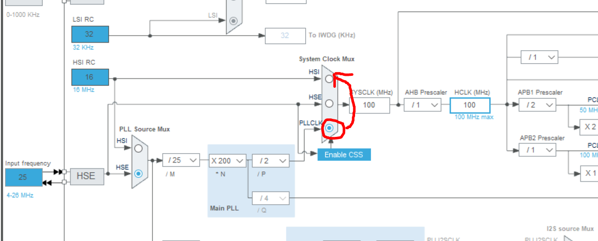
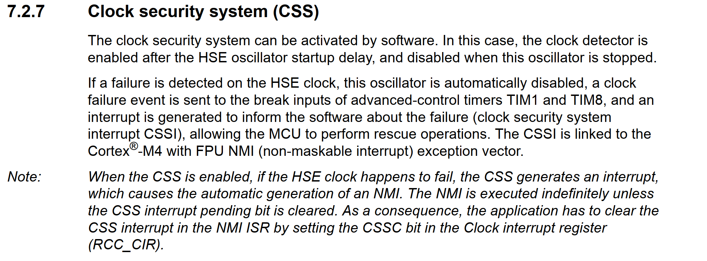

## 背景 ## 
&emsp;&emsp;在可靠性需求中，需要考虑在外部晶振失效的情况下，能够将系统的晶振源切换为内部的振荡器，让系统至少能够维持能够发出晶振失效告警的状态，如果能让系统保持正常系统正常运行那是最好。

## 方法 ##
&emsp;&emsp;在stm32中，有Clock security system (CSS)的机制，当外部晶振出现问题
，比如晶振停振、短时间内出现大的频率偏差就会触发(fae说的，没有找到具体的触发机制文档)，当触发时会系统时钟源会从HSE或者HSE为源的PLL切换到HSI，并进入NMI.(non-maskable interrupt)中断。

&emsp;&emsp;当在cubemx中配置Enable CSS后，会在NMI中断中跳转到HAL_RCC_NMI_IRQHandler函数中，可以在该函数中进行时钟的重新配置，将PLL Source Mux的源调整为HSI，并将M\N\P的系数进行调整，使系统时钟与之前保持一致。之后系统会以内部时钟的形式继续运行。经过实测can通讯串口通讯不会受到影响，切换会花费多少时间还需测试。

