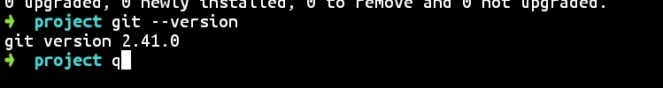

# 背景
买了台荣耀的v8pro想平时用来写写画画，顺便写写文档博客之类的，就想折腾下看看怎么在安卓平板上搞一套环境。反正有这篇文档的时候环境肯定是能用了。大致讲一下配置把

# 环境搭建
1. markdown的编辑器用的软件是markor，对平板支持不错。
2. git环境的搭建用的是termux，靠这个就可以在平板上用命令行了，
    先更新源
    `apt update && apt upgrade`
    再进行git安装
    `pkg install git`
    安装完成后，查看下版本信息，看看是否安装成功
    `git --version`
    

    输入如下指令，然后允许获取存储权限，平板的本地存储就会挂载到"／sdcard／"这个路径下面
    `termux-setup-storage`

    生存ssh密钥，把公钥同步到github上
    `ssh-keygen`

    git环境就配好了。

3. 拉取好github上的仓库后，用markor进行编辑操作，再通过命令行推送到远程就ok了。

  
# 待解决和尝试
1. 还没尝试在平板上搭建hexo的环境，所以博客的部署还需要通过ssh到服务器上来操作。要是能搭好环境，那就很爽了。  
